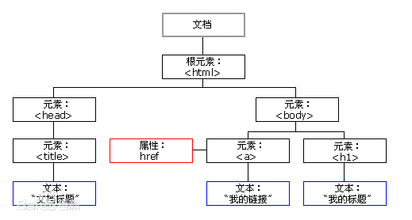
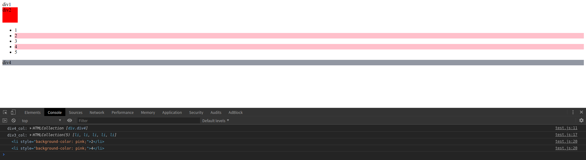

# JavaScript历史背景
* 布兰登 • 艾奇(Brendan Eich，1961年~至今)，1995年在网景公司，发明的JavaScript。
* 一开始JavaScript叫做LiveScript，但是由于当时Java这个语言特别火，所以为了傍大牌，就改名为JavaScript。
* 同时期还有其他的网页语言，比如VBScript、JScript等等，但是后来都被JavaScript打败了，所以现在的浏览器中，只运行一种脚本语言就是JavaScript。
## 什么是JavaScript
JavaScript是web上一种功能强大的编程语言，用于开发交互式的web页面。它不需要进行编译，而是直接嵌入在HTML页面中，由浏览器执行。
* JavaScript被设计用来向HTML页面添加交互行为。
* JavaScript是一种脚本语言(脚本语言是一种轻量级的编程语言)。
* JavaScript由数行可执行计算机代码组成。
* JavaScript通常被直接嵌入HTML页面。
* JavaScript是一种解释性语言(就是说代码执行不进行预编译)。
## JavaScript的组成
* 核心(ECMAscript)：语法，语句。
* 文档对象模型(DOM)：document object model，操作文档中的元素和内容。
* 浏览器对象模型(BOM)：浏览器对象。
## JavaScript的作用
* 使用JavaScript添加页面动画效果，提供用户操作体验。
* 主要应用有：嵌入动态文本于HTML页面、对浏览器事件作出响应、读取HTML元素、验证提交数据、检测访客的浏览器信息等。
## JavaScript的引入
在HTML文件中引入JavaScript有3种方式，一种是在HTML文档直接嵌入JavaScript脚本，称为内嵌式，另一种是链接外部JavaScript脚本文件，称为外联式。
* 行内引入，在标签元素中引入js代码
    ```javascript
    <!DOCTYPE html>
    <html lang="en">
    <head>
        <meta charset="UTF-8">
        <title>行内引入js</title>
        <style>
            #div1 {
                background-color: red;
                width: 80px;
                height: 40px;
            }
        </style>
    </head>
    <body>
    <div id="div1" onclick="alert('点击了哈哈哈')">哈哈哈</div>
    </body>
    </html>
    ```
* 内嵌式，在HTML文档中，通过`<script>`标签引入
    ```javascript
    <!DOCTYPE html>
    <html lang="en">
    <head>
        <meta charset="UTF-8">
        <title>引入js的方式</title>
        <style>
            #div1 {
                background-color: red;
                width: 80px;
                height: 40px;
            }
        </style>
    <!--    style标签只能放在head头部标签中，script标签即可以放在head头部标签中，也可以放在body标签中。-->
    <!--    html页面加载顺序是从上往下开始加载的。所以当script标签(里边有对页面元素进行操作的代码)放在head头部中可能会出现，无法执行script标签内的代码的情况。-->
        <script type="text/javascript">
            alert("哈哈哈哈哈哈哈")
        </script>
    </head>
    <body>
    <!--<div id="div1" onclick="alert('点击了哈哈哈')">哈哈哈</div>-->
    <div id="div1">哈哈哈</div>
    </body>
    </html>
    ```
* 外联式，在HTML文档中，通过`<script src="">`标签引入`xxx.js`文件
    
    `quote_js.html`
    ```javascript
    <!DOCTYPE html>
    <html lang="en">
    <head>
        <meta charset="UTF-8">
        <title>引入js的方式</title>
        <style>
            #div1 {
                background-color: red;
                width: 80px;
                height: 40px;
            }
        </style>
        <!--    外联式引入js-->
        <script type="text/javascript" src="main.js"></script>
        <!--    style标签只能放在head头部标签中，script标签即可以放在head头部标签中，也可以放在body标签中。-->
        <!--    html页面加载顺序是从上往下开始加载的。所以当script标签(里边有对页面元素进行操作的代码)放在head头部中可能会出现，无法执行script标签内的代码的情况。-->
        <!--    <script type="text/javascript">-->
        <!--        alert("哈哈哈哈哈哈哈");-->
        <!--    </script>-->
    </head>
    <body>
    <!--<div id="div1" onclick="alert('点击了哈哈哈')">哈哈哈</div>-->
    <div id="div1">哈哈哈</div>
    </body>
    </html>
    ```
    `main.js`
    ```javascript
    alert("外联js");
    ```
## 基本语法
### 注释
通过添加注释来对JavaScript代码进行注释，增强代码可读性
* 单行注释：以`//`开头
* 多行注释：以`/*`开始，以`*/`结尾
### 变量命名规则
* 必须以字母或下划线开头
* 变量名不能包含空格等符号
* 不能使用JavaScript关键字作为变量名，如：`function`
* 变量名对大小写敏感，JavaScript严格区分大小写。
* 小驼峰命名
### 变量声明
* 必须使用`var`关键字来声明变量,JavaScript变量可以不声明，直接使用。默认值：`undefined`
    ```javascript
    var name;
    ```
* 声明变量并赋值
    ```javascript
    //JavaScript是弱类型语言，即同一个变量可以存放不同类型的数据。(js在声明变量时不用指定变量的数据类型，这点跟Java不同。)
    var name = "小花花";
    var age = 21;
    var gender;
    // console.log()打印变量值到控制台
    console.log("name:" + name);
    console.log("age:" + age);
    ```
* 同时声明多个变量并赋值
    ```javascript
    //同时给多个变量赋值
    var a = 10, b = 20, c = 30;
    console.log(a, b, c);
    ```
### 数据类型
* 数字类型
    ```javascript
    var bookName = "疯狂Python讲义";
    var price = 59.99;
    console.log("《" + bookName + "》" + "售价" + price + "元");//输出：《疯狂Python讲义》售价59.99元
    ```
* 字符串
    ```javascript
    var bookName = "疯狂Python讲义";
    var price = 59.99;
    console.log("《" + bookName + "》" + "售价" + price + "元");//输出：《疯狂Python讲义》售价59.99元
    ```
* 数组
    ```javascript
    //类似于Python中的列表，通过下标进行取值
    var myArrayList = Array(1, 2, 3, "哈哈哈");
    console.log(myArrayList[0]);
    console.log(myArrayList[1]);
    console.log(myArrayList[2]);
    console.log(myArrayList[3]);
    //length返回数组的长度
    console.log("myArrayList数组的长度为：" + myArrayList.length);//myArrayList数组的长度为：4
    //push向数组末尾插入元素
    myArrayList.push("Go");
    console.log(myArrayList);//[1, 2, 3, "哈哈哈", "Go"]
    myArrayList.push("Python", "Java");
    console.log(myArrayList);//[1, 2, 3, "哈哈哈", "Go", "Python", "Java"]
    //pop删除数组中最后一个元素并将被删除的元素返回
    console.log(myArrayList.pop());//Java
    console.log(myArrayList);//[1, 2, 3, "哈哈哈", "Go", "Python"]
    console.log(myArrayList.pop());//Python
    console.log(myArrayList);//[1, 2, 3, "哈哈哈", "Go"]
    console.log(myArrayList.pop());//Go
    console.log(myArrayList);//[1, 2, 3, "哈哈哈"]
    ```
* `null`,类似于Python中的`None`
    ```javascript
    //null：空类型，类似于Python中的None
    var myHobby = null;
    //变量已声明未赋值，此变量不是空类型，是undefined
    var myHeight;
    console.log("myHobby:" + myHobby + ", myHeight:" + myHeight);//myHobby:null, myHeight:undefined
    ```
* `undefined`
    ```javascript
    //null：空类型，类似于Python中的None
    var myHobby = null;
    //变量已声明未赋值，此变量不是空类型，是undefined
    var myHeight;
    console.log("myHobby:" + myHobby + ", myHeight:" + myHeight);//myHobby:null, myHeight:undefined
    ```
* `boolean`
    ```javascript
    var areYouOK = true;
    var areWeOK = false;
    console.log("areYouOK:" + areYouOK);//areYouOK:true
    console.log("areWeOK:" + areWeOK);//areWeOK:false
    ```
### 运算符
* 算术运算符：`+(加)`, `-(减)`, `*(乘)`, `/(除)`, `%(取余)`
* 赋值运算符：`=(赋值)`, `+=(加等于)`, `-=(减等于)`, `*=(乘等于)`, `/=(除等于)`, `%=(取余等于)` 
* 条件运算符：`==(代表相等，比较的两个值内容相等即可，数据类型可以不一样)`, `===(代表严格相等:数据类型和值都相等)`, `>`, `>=`, `<`, `<=`, `!=`
* 逻辑运算符：`&&(并且)`, `||(或者)`, `!(否)`

验证`==`和`===`的区别
```javascript
var bookPrice = 45.9;
var bookPrice1 = "45.9";
console.log(bookPrice == bookPrice1);//true
console.log(bookPrice === bookPrice1);//false
```

### 条件语句
* `if ... else if ... else...`语句
    ```javascript
    var age = 21;
    if (age > 21) {
        console.log("年龄大于21岁!");
    } else if (age === 21) {
        console.log("年龄等于21岁!");
    } else {
        console.log("年龄小于21岁!");
    }
    //输出：年龄等于21岁!
    ```
* `switch`语句
    ```javascript
    var a = 9, b = 7;
    switch (a - b) {
        case 4:
            console.log(a + " - " + b + " = " + 4);
            break;
        case 2:
            console.log(a + " - " + b + " = " + 2);
            break;
        case 3:
            console.log(a + " - " + b + " = " + 3);
            break;
        default:
            console.log(a + " - " + b + " = 默认值");
            break;
    }
    //输出：9 - 7 = 2
    ```
### 循环
`while`循环
```javascript
var a = 21;
while (a <= 30) {
    console.log(a);//输出：21到30
    a++;
}
```
`for`循环
```javascript
for (var i = 1; i <= 10; i++) {
    console.log(i);//输出1到10
}
```
`for in`循环
* `for in`循环遍历数组
    ```javascript
    var myArray = Array("小花花", 21, "女", "打羽毛球");
    for (j in myArray) {
        // console.log(j);//输出0到3，输出的是myArray数组的元素下标
        console.log(myArray[j]);//输出：小花花 21 女 打羽毛球
    }
    ```
* `for in`循环遍历对象
    ```javascript
    var objA = {
        name: "小花花",
        age: 21,
        gender: "女",
        hobby: "旅行"
    };
    for (n in objA) {
        // console.log(n);//输出的是对象的属性：name age gender hobby
        console.log(objA[n]);//输出对象的属性值：小花花 21 女 旅行
    }
    ```
### 函数
#### 函数定义
定于本函数的关键字`function`,函数内的代码块包裹在花括号内
```javascript
//函数定义 使用function关键字
function test() {
    console.log("这是一个函数!");
}

//函数调用
test();
//输出：这是一个函数!
```
#### 函数参数
```javascript
//函数定义 使用function关键字
function addition(a, b) {
    result = (a + b);
    console.log(a + " + " + b + " = " + result);
}

//函数调用
addition(100, 199);
//输出：100 + 199 = 299
```
#### 函数返回值
```javascript
//在使用return语句时，程序执行到return语句时会立刻终止，并返回函数的返回值
function addition(a, b) {
    result = (a + b);
    return result;
}

//函数调用
var res = addition(100, 199);
console.log("res = " + res);
//输出：res = 299
```
### 对象
#### 创建对象
创建对象的两种方式
* 方式一
    ```javascript
    objA = new Object();
    ```
* 方式二，类似于Python中的字典
    ```javascript
    var objB = {};
    ```
#### 对象属性
* 对象的属性以键值对(name:value)的形式定义，属性由逗号分离。
    ```javascript
    var objC = {name: "python", age: 21, gender: "男"};
    ```
* 创建对象属性声明可以横跨多行
    ```javascript
    var objD = {
        name: "小花花",
        age: "21",
        gender: "女"
    };
    ```
#### 操作对象的属性
```javascript
var objC = {name: "小华华", age: 21, gender: "男"};
//获取objC对象的属性
console.log(objC.name);//小华华
console.log(objC["age"]);//21
console.log(objC);//{name: "小华华", age: 21, gender: "男"}
//修改objC对象的属性值
objC.name = "小刚刚";
console.log(objC);//{name: "小刚刚", age: 21, gender: "男"}
objC["age"] = 22;
console.log(objC);//{name: "小刚刚", age: 22, gender: "男"}
```

#### 对象方法
```javascript
//对象方法：对象方法是作为属性来存储的函数
var objD = {
    name: "小花花",
    age: "21",
    gender: "女",
    func: function (a, b) {
        alert("对象方法");
        this.name = "大花花";//this来修改了objD对象的name属性的值为"大花花"
        return a + b;
    }
};

res = objD.func(10, 15);
console.log(res);//25
console.log(objD);//{name: "大花花", age: "21", gender: "女", func: ƒ}
```
## JS操作页面
### DOM简介
通过HTML DOM可以访问JavaScript文档的所有元素。

当网页被加载时，浏览器会创建页面的文档对象模型(Document Object Model)。
 
HTML DOM被构造为对象的树。

HTML DOM树

节点树中的节点彼此拥有层级关系
* 父(parent)、子(child)和同胞(sibling)等术语用于描述这些关系。父节点拥有子节点。同级的子节点被称为同胞(兄弟或姐妹)。

通过可编程的对象模型，JavaScript获得了足够的能力来创建动态的HTML。
* 如何改变HTML元素的内容(innerHTML)。
* 如何改变HTML元素的样式(CSS)。
* 如何对HTML DOM事件做出反应。
* 如何添加或删除HTML元素。

### 获取页面标签
通常通过JavaScript操作HTML元素，可以使用内置的对象document的方法来找到标签。

**`test_js.html`**
```html
<!DOCTYPE html>
<html lang="en">
<head>
    <meta charset="UTF-8">
    <title>js操作页面</title>
    <script type="text/javascript" src="test.js"></script>
</head>
<body>
<div id="div1">div1</div>
<div id="div2">div2</div>
<div class="div3">
    <ul>
        <li>1</li>
        <li>2</li>
        <li>3</li>
        <li>4</li>
        <li>5</li>
    </ul>
</div>
<div class="div4">div4</div>
</body>
</html>
```
* 通过`id`找到HTML元素(常用)。
    * `document.getElementById();`
    ```javascript
    //等到页面全部加载完成后再执行
    window.onload = function () {
        //通过id选择元素
        var div2 = document.getElementById("div2");
        div2.style.backgroundColor = 'red';
        div2.style.width = "50px";
        div2.style.height = "50px";
    };
    ```
* 通过标签名找到HTML元素
    * 获取出来的是列表
    * `getElementsByTagName();`
    ```javascript
    //等到页面全部加载完成后再执行
    window.onload = function () {
        //通过tagName标签名字来选择，返回的是选择集
        var div3_col = document.getElementsByTagName('li');
        console.log("div3_col:", div3_col);
        for (var j = 0; j < div3_col.length; j++) {
            if (j % 2 !== 0) {
                console.log(div3_col[j]);
                div3_col[j].style.backgroundColor = 'pink';
            }
    
        }
    };
    ```
* 通过`class`类名找到HTML元素(通过class查找HTML元素在IE5,6,7,8中无效)
    * 获取出来的是列表
    * `getElementsByClassName();`
    ```javascript
    //等到页面全部加载完成后再执行
    window.onload = function () {
        //通过class选择元素，返回的是选择集
        var div4_col = document.getElementsByClassName('div4');
        console.log("div4_col:", div4_col);//HTMLCollection [div.div4]
        var div4 = document.getElementsByClassName('div4')[0];
        div4.style.background = '#9297a2';
    };
    ```
执行以上js代码后，在浏览器中`test_js.html`渲染效果如下


### 操作标签内容
`innerHTML`用来获取/替换HTML元素的内容。

* 读取HTML元素内容
    ```javascript
    var div1 = document.getElementsByClassName("div1")[0];
    //输出被选择标签(div1)内的所有HTML内容
    console.log(div1.innerHTML);
    /*
    div1.innerHTML输出：
    <ul>
        <li>li1</li>
        <li>li2</li>
        <li>li3</li>
        <li>li4</li>
        <li>li5</li>
    </ul>
    <h3>哈啊啊啊啊啊啊啊</h3>
     */
    ```
* 只读取HTML元素文本
    ```javascript
    var div1 = document.getElementsByClassName("div1")[0];
    //只获取被选择标签(div1)内的HTML内容的文本
    console.log(div1.innerText);
    /*
    div1.innerText输出：
    li1
    li2
    li3
    li4
    li5
    哈啊啊啊啊啊啊啊
     */
    ```
* 替换HTML元素内容
    ```javascript
    var div1 = document.getElementsByClassName("div1")[0];
    //innerHTML修改被选择标签里的内容
    div1.innerHTML = "<h1>人生苦短，Let's Go!</h1>";
    //输出被选择标签(div1)内的所有HTML内容
    console.log(div1.innerHTML);//console控制台输出：<h1>人生苦短，Let's Go!</h1>
    ```
代码示例

**`action_label_content.html`**
```html
<!DOCTYPE html>
<html lang="en">
<head>
    <meta charset="UTF-8">
    <title>操作标签内容</title>
    <script src="action_label_content.js"></script>
</head>
<body>

<br>
<form action="">
    请输入：<input type="text" id="input1">
</form>
<br>
<div class="div1">
    <ul>
        <li>li1</li>
        <li>li2</li>
        <li>li3</li>
        <li>li4</li>
        <li>li5</li>
    </ul>
    <h3>哈啊啊啊啊啊啊啊</h3>

</div>
<a href="https:www.baidu.com" target="_blank" id="baidu1" class="baidu2">百度一下</a>

</body>
</html>
```
**`action_label_content.js`**
```javascript
window.onload = function () {
    var div1 = document.getElementsByClassName("div1")[0];
    //输出被选择标签(div1)内的所有HTML内容
    console.log(div1.innerHTML);
    /*
    div1.innerHTML输出：
    <ul>
        <li>li1</li>
        <li>li2</li>
        <li>li3</li>
        <li>li4</li>
        <li>li5</li>
    </ul>
    <h3>哈啊啊啊啊啊啊啊</h3>
     */

    //只获取被选择标签(div1)内的HTML内容的文本
    console.log(div1.innerText);
    /*
    div1.innerText输出：
    li1
    li2
    li3
    li4
    li5
    哈啊啊啊啊啊啊啊
     */

    /**
     * innerHTML写入节点文本
     */
    //innerHTML修改被选择标签里的内容
    div1.innerHTML = "<h1>人生苦短，Let's Go!</h1>";
    //输出被选择标签(div1)内的所有HTML内容
    console.log(div1.innerHTML);//console控制台输出：<h1>人生苦短，Let's Go!</h1>
    //只获取被选择标签(div1)内的HTML内容的文本
    console.log(div1.innerText);//console控制台输出：人生苦短，Let's Go!
};
```
### 修改标签属性
html代码示例
```html
<!DOCTYPE html>
<html lang="en">
<head>
    <meta charset="UTF-8">
    <title>操作标签内容</title>
    <script src="action_label_content.js"></script>
</head>
<body>

<br>
<form action="">
    请输入：<input type="text" id="input1">
</form>
<br>
<div class="div1">
    <ul>
        <li>li1</li>
        <li>li2</li>
        <li>li3</li>
        <li>li4</li>
        <li>li5</li>
    </ul>
    <h3 id="h3Id" class="h3Class">哈啊啊啊啊啊啊啊</h3>

</div>

<div class="div2">哈哈哈哈哈哈哈</div>

<a href="https:www.baidu.com" target="_blank" id="baidu1" class="baidu2">百度一下</a>


</body>
</html>
```
JavaScript代码示例
```javascript
window.onload = function () {
    /**
     * 修改元素属性
     */
    var a = document.getElementById("baidu1");
    //将a标签的超链接`https:www.baidu.com`改为`https:www.jd.com`
    a["href"] = "https:www.jd.com";
    //将a标签的文本`百度一下`改为`点我跳转至京东`
    a["text"] = "点我跳转到京东";
    //修改a标签的class属性名(两种方式都可以修改)
    a["className"] = "a_CLASS";
    //操作Class的时候，需要将`class`修改为`className`
    a.className = "a_CLASS1";

    var input = document.getElementById("input1");
    //input文本输入框修改为密码输入框
    input.type = "password";
    /**
     * 修改元素CSS样式
     */
    var div2 = document.getElementsByClassName("div2")[0];
    div2.style.background = "pink";
    div2.style.width = "50%";
    div2.style["height"] = "100px";
}
```
### onclick事件
onclick事件是指HTML元素绑定了点击事件，在前端页面只要点击了该HTML元素就会触发点击事件。
* `HTML`行内标签绑定`onclick`事件
    ```html
    <!DOCTYPE html>
    <html lang="en">
    <head>
        <meta charset="UTF-8">
        <title>操作标签内容</title>
        <script src="action_label_content.js"></script>
    </head>
    <body>
    <div class="div3" style="background-color: #1E90FF;width: 100px;height: 80px" onclick=alert("你点击了div3")>div3</div>
    </body>
    </html>
    ```
* HTML行内标签绑定`onclick`事件,`onclick`事件绑定需要调用的函数(函数需要声明在当前HTML页面的head中)
    ```html
    <!DOCTYPE html>
    <html lang="en">
    <head>
        <meta charset="UTF-8">
        <title>操作标签内容</title>
        <script src="action_label_content.js"></script>
        <script>
            //定义一个函数，作为div4的onclick点击事件
            function myClick() {
                alert("你点击了div4!");
            }
        </script>
    </head>
    <body>
    //给div定义一个onclick事件，触发该事件时，调用onclick绑定的函数
    <div class="div4" style="background-color: chartreuse;width: 100px;height: 80px" onclick="myClick()">div4</div>
    </body>
    </html>
    ```
