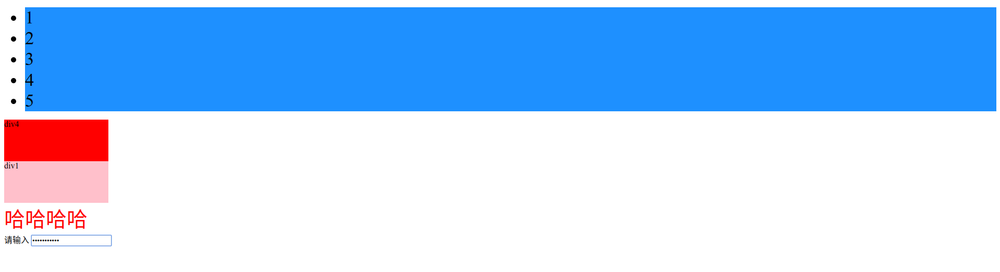

# jQuery的介绍和引用
jQuery是目前使用最广泛的JavaScript函数库。

jQuery的版本分为1.x系列和2.x、3.x系列，1.x系列兼容低版本浏览器，2.x、3.x系列放弃对低版本浏览器的支持。

目前使用最多的是1.x系列版本的jQuery。

## 相关资源
* [jQuery官方网站](https://jquery.com/)
* [从jQuery CDN下载jQuery](https://code.jquery.com/)
* [jQuery在线手册](https://www.runoob.com/manual/jquery/)

## jQuery的引入
jQuery是一个函数库，一个js文件，页面使用script标签引入这个js文件即可。
```javascript
<!DOCTYPE html>
<html lang="en">
<head>
    <meta charset="UTF-8">
    <title>jQueryTest</title>
    <!--head标签中引入jQuery-->
    <script type="text/javascript" src="../frontend/js/jquery-1.12.4.min.js"></script>
</head>
<body>

</body>
</html>
```
## jQuery选择器
jQuery用法思想
* 选择某个网页元素，然后对它进行某种操作。

jQuery中设置等待页面元素全部加载完成后再执行JavaScript代码
```javascript
//等到页面元素全部加载完成后再执行JavaScript代码
<!DOCTYPE html>
<html lang="en">
<head>
    <meta charset="UTF-8">
    <title>jQueryTest</title>
    <!--head标签中引入jQuery-->
    <script type="text/javascript" src="../frontend/js/jquery-1.12.4.min.js"></script>
    <!--等到页面元素全部加载完成后再执行JavaScript代码-->
    <script type="text/javascript">
        $(function () {
            // 此处为JavaScript代码
        });
    </script>
</head>
<body>
<div class="div3">
    <ul>
        <li>1</li>
        <li>2</li>
        <li>3</li>
        <li>4</li>
        <li>5</li>
    </ul>
</div>
<div class="div4">div4</div>

</body>
</html>
```
### jQuery基本选择器
jQuery选择器可以快速选择元素，选择规则与CSS样式相同，使用length属性判断是否选择成功。
* `id`选择器
    * `$("#btn1")`
        * 示例
            ```javascript
            // 通过id选择标签元素，操作标签元素的CSS样式
            $("#div4").css({width: "200px", height: "80px", background: "red"});
            ```
* 类选择器
    * `$(".div1")`
        * 示例
            ```javascript
            // 通过类选择器选择标签元素，操作标签元素的CSS样式
            $(".div1").css({width: "200px", height: "80px", background: "pink"});
            ```
* 标签选择器
    * `$("li")`
        * 示例
            ```javascript
            //通过标签选择器选择标签元素,在jQuery中选择集可以直接设置样式，不用像js那样还得通过遍历`选择集`中的元素来依次设置样式。
            $("li").css({background: "#1E90FF", fontSize: "35px"});
            ```
* 层级选择器
    * `$("#ul li span")`
        * 示例
            ```javascript
            //fontSize解释：在遇到在CSS中设置样式如：font-size时，在jQuery中则需要去掉中横线`-`然后采用小驼峰命名规则来设置CSS样式
            $(".form1 div span").css({fontSize: "40px", color: "red"});
            ```
* 属性选择器
    * `$("input[name=user]")`
        * 示例
            ```javascript
            //通过属性选择器修改input标签的type为password
            $("input[type=text]").attr("type", "password");
            ```
#### 代码示例
```html
<!DOCTYPE html>
<html lang="en">
<head>
    <meta charset="UTF-8">
    <title>jQueryTest</title>
    <!--head标签中引入jQuery-->
    <script type="text/javascript" src="../frontend/js/jquery-1.12.4.min.js"></script>
    <!--等到页面元素全部加载完成后再执行JavaScript代码-->
    <script type="text/javascript">
        $(function () {
            // 此处为JavaScript代码
            // 通过id选择标签元素，操作标签元素的CSS样式
            $("#div4").css({width: "200px", height: "80px", background: "red"});
            // 通过类选择器选择标签元素，操作标签元素的CSS样式
            $(".div1").css({width: "200px", height: "80px", background: "pink"});
            //通过标签选择器选择标签元素,在jQuery中选择集可以直接设置样式，不用像js那样还得通过遍历`选择集`中的元素来依次设置样式。
            $("li").css({background: "#1E90FF", fontSize: "35px"});
            //通过层级选择器选择元素
            //fontSize解释：在遇到在CSS中设置样式如：font-size时，在jQuery中则需要去掉中横线`-`然后采用小驼峰命名规则来设置CSS样式
            $(".form1 div span").css({fontSize: "40px", color: "red"});
            //通过属性选择器修改input标签的type为password
            $("input[type=text]").attr("type", "password");
        });
    </script>
</head>
<body>
<div class="div3">
    <ul>
        <li>1</li>
        <li>2</li>
        <li>3</li>
        <li>4</li>
        <li>5</li>
    </ul>
</div>
<div class="div4" id="div4">div4</div>
<div class="div1" id="div1" style="font-size: ">div1</div>
<form action="" class="form1">
    <div class="div2">
        <span>哈哈哈哈</span>
    </div>
    <label for="input1">请输入</label>
    <input type="text" id="input1">
</form>

</body>
</html>
```
#### 页面效果


### 选择同胞和父辈元素
* 选择div元素前面紧挨着的同辈元素
    * `$("div).prev();`
        * 示例
            ```javascript
            //选择id为li3元素前面紧挨着的同辈元素
            $("#li3").prev().css({backgroundColor: "red"});
            ```
* 选择div元素之前所有的同辈元素
    * `$("div).prevAll();`
        * 示例
            ```javascript
            //选择id为li3元素之前所有的同辈元素
            $("#li3").prevAll().css({backgroundColor: "red"});
            ```
* 选择div元素后面紧挨着的同辈元素
    * `$("div).next();`
        * 示例
            ```javascript
            //选择id为li3元素后面紧挨着的同辈元素
            $("#li3").next().css({backgroundColor: "pink"});
            ```
* 选择div元素后面所有的同辈元素
    * `$("div).nextAll();`
        * 示例
            ```javascript
            // 选择id为li3元素后面所有的同辈元素
            $("#li3").nextAll().css({backgroundColor: "pink"});
            ```
* 选择div的父元素
    * `$("div).parent();`
        * 示例
            ```javascript
            // 选择id为li3的父元素
            $("#li3").parent().css({backgroundColor : "red"});
            ```
* 选择div的所有子元素
    * `$("div).children();`
        * 示例
            ```javascript
            // 选择div2标签的所有子元素
            $(".div2").children().css({backgroundColor: "red"});
            ```
* 选择div的同级元素
    * `$("div).siblings();`
        * 示例
            ```javascript
            // 选择div2的同级元素
            $(".div2").siblings().css({backgroundColor: "pink", width: "80%", height: "100px"});
            ```
* 选择div中class等于cs的元素
    * `$("div).find('.cs);`
        * 示例
            ```javascript
            //选择div1中class等于div3的元素
            $("#div1").find(".div3").css({backgroundColor: "blue", width: "80%", height: "100px"});
            ```
#### 代码示例
```html
<!DOCTYPE html>
<html lang="en">
<head>
    <meta charset="UTF-8">
    <title>jQuery选择器选择同胞和父辈元素练习demo</title>
    <script type="text/javascript" src="../frontend/js/jquery-1.12.4.min.js"></script>
    <script type="text/javascript">
        $(function () {
            //测试时需要一条一条来测试，把除当前测试选择器的其他选择器代码注释掉
            //链式调用
            $("#li3").css({backgroundColor: "blue"}).prev().css({backgroundColor: "red"});
            //选择id为li3元素前面紧挨着的同辈元素
            $("#li3").prev().css({backgroundColor: "red"});
            //选择id为li3元素之前所有的同辈元素
            $("#li3").prevAll().css({backgroundColor: "red"});
            //选择id为li3元素后面紧挨着的同辈元素
            $("#li3").next().css({backgroundColor: "pink"});
            // 选择id为li3元素后面所有的同辈元素
            $("#li3").nextAll().css({backgroundColor: "pink"});
            // 选择id为li3的父元素
            $("#li3").parent().css({backgroundColor : "red"});
            // 选择div2标签的所有子元素
            $(".div2").children().css({backgroundColor: "red"});
            // 选择div2的同级元素
            $(".div2").siblings().css({backgroundColor: "pink", width: "80%", height: "100px"});
            //选择div1中class等于div3的元素(也可以查找id，层级选择器去查找等等)
            $("#div1").find(".div3").css({backgroundColor: "blue", width: "80%", height: "100px"});

        });
    </script>
</head>
<body>
<div id="div1">
    <div class="div2">
        <ul>
            <li id="li1">1</li>
            <li id="li2">2</li>
            <li id="li3">3</li>
            <li id="li4">4</li>
            <li id="li5">5</li>
        </ul>
        <span>哈哈哈哈哈</span>
    </div>
    <div id="div3" class="div3">拉拉啊啊啊啊啊啊啊啊</div>
    <span>分割线</span>
    <div class="div3">拉拉啊啊啊啊啊啊啊啊1</div>
    <span>分割线</span>
    <div id="div4">噢耶撒旦法十分广泛宣传费</div>
</div>

</body>
</html>
```
### 选择过滤
* 选择包含`p`标签的的div元素
    * `$("div").has("p");`
        * 示例
            ```javascript
            // 选择包含`p`标签的的div元素
            $("div").has("p").css({width: "400px", height: "100px", backgroundColor: "red"});
            ```
* 选择`class`不等于`cs`的`div`元素(也可以查找id等等)
    * `$("div").not(".cs");`
        * 示例
            ```javascript
            // 选择`class`不等于`div6`的`div`元素(也可以查找id等等)
            $("div").not(".div6").css({backgroundColor: "red", width: "100%"});
            // 选择`id`不等于`div7`的`div`元素
            $("div").not("#div7").css({backgroundColor: "pink", width: "50%"});
            ```
* 选择`class`等于`cs`的`div`元素
    * `$("div").filter(".cs");`
        * 示例
            ```javascript
            // 选择`class`等于`div7`的`div`元素
            $("div").filter(".div7").css({backgroundColor: "#1E90FF", fontSize: "30px"});
            ```
* 选择第4个(也就是索引为3)`div`元素
    * `$("div").eq(6);`
        * 示例
            ```javascript
            // 选择第4个(也就是索引为3)`span`元素
            $("span").eq(3).css({backgroundColor: "red", fontSize: "30px"});
            ```
* 获取元素的索引值
    * 有时候需要获得匹配元素相对于其同胞元素的索引位置，此时可以使用index()方法获取
        * 示例
            ```javascript
            var $li = $("li").eq(2);
            //弹出元素的索引也就是2
            alert($li.index())
            ```
#### 完整代码示例
```html
<!DOCTYPE html>
<html lang="en">
<head>
    <meta charset="UTF-8">
    <title>jQuery选择过滤示例demo</title>
    <script type="text/javascript" src="../frontend/js/jquery-1.12.4.min.js"></script>
    <script type="text/javascript">
        $(function () {
            // // 选择包含`p`标签的的div元素
            // $("div").has("p").css({width: "400px", height: "100px", backgroundColor: "red"});
            // // 选择`class`不等于`div6`的`div`元素(也可以查找id等等)
            // $("div").not(".div6").css({backgroundColor: "red", width: "100%"});
            // // 选择`id`不等于`div7`的`div`元素
            // $("div").not("#div7").css({backgroundColor: "pink", width: "50%"});
            // // 选择`class`等于`div7`的`div`元素
            // $("div").filter(".div7").css({backgroundColor: "#1E90FF", fontSize: "30px"});
            // //选择`class=div1`下`class=div7`的div元素
            // $(".div1 div").filter(".div7").css({backgroundColor: "#1E90FF", fontSize: "30px"});
            // 选择第4个(也就是索引为3)`span`元素
            // $("span").eq(3).css({backgroundColor: "red", fontSize: "30px"});
            var $li = $("li").eq(2);
            //弹出元素的索引也就是2
            alert($li.index())
        });
    </script>
</head>
<body>
<div class="div1">
    <div class="div2">div2
        <p>这是一个p标签</p>
    </div>
    <span>分割线</span>
    <div class="div3">div3</div>
    <span>分割线</span>
    <div class="div4">div4</div>
    <span>分割线</span>
    <div class="div7">div7_01</div>
    <span>分割线</span>
    <div class="div5">div5</div>
</div>
<span>分割线</span>
<div class="dv">dv
    <ul>
        <li>li1</li>
        <li>li2</li>
        <li>li3</li>
        <li>li4</li>
        <li>li5</li>
    </ul>
</div>
<span>分割线</span>
<div class="div7">div7_02</div>
<span>分割线</span>
<div class="div6">div6</div>
<span>分割线</span>
<div id="div7" class="div7">div7_03</div>


</body>
</html>
```
## jQuery操作样式
TODO