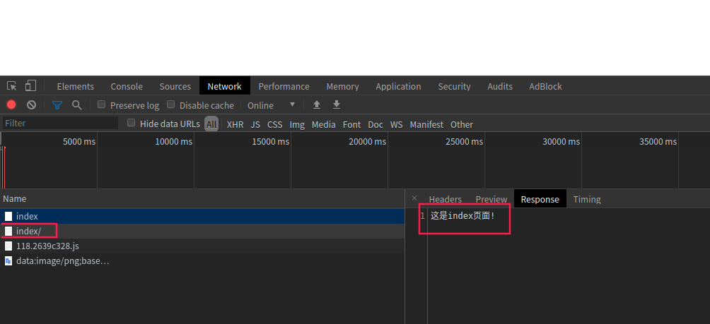

# Flask
## 简单介绍
* `Flask`是一个使用`Python`编写的`轻量级Web应用框架`。其`WSGI工具箱`采用`Werkzeug`，`模板引擎`则使用`Jinja2`。`Flask`使用`BSD授权`。
* Flask也被称为`microframework`，因为它使用简单的核心，用`extension`增加其他功能。`Flask`没有默认使用的`数据库`、`窗体验证工具`。
## 通过pip安装flask
```bash
pip3 install -i https://pypi.tuna.tsinghua.edu.cn/simple flask
```
## 编写第一个flask程序
```python
#!/usr/bin/python3
# @FileName    :first_flask_script.py
# @Time        :2020/5/31 上午12:45
# @Author      :ABC
# @Description :第一个flask程序

# 从flask包导入需要用到的包
from flask import Flask, render_template, request

# 初始化application
app = Flask(__name__)


# 添加路由
@app.route("/")
def index():
    # args = request.args # 获取传入的的参数 可以是：params形式参数、form形式参数、json形式参数、file格式文件
    data = request.args.get("user")

    if data is None:
        return "<h1 style='color:red'>这是index界面</h1>"
    else:
        return "<h1 style='color:red'>hello!" + data + ", 欢迎来到index界面!</h1>"


@app.route("/hello")
def hello():
    # 返回一个HTML格式的文件(默认所有HTML文件都存储在templates目录下，当访问程序运行时匹配到`/hello`时，会自动去templates目录下查找匹配到的HTML文件)
    return render_template('hello.html')


# 运行服务器
# 也可以通过关键字参数绑定host、port、debug(是否开启debug模式：True/False 开启后再更改完代码后，会自动重启flask应用)
app.run(port=12306, debug=True)
```
templates目录下的hello.html文件
```html
<!DOCTYPE html>
<html lang="en">
<head>
    <meta charset="UTF-8">
    <title>自我介绍</title>
</head>
<body>
<h1>个人信息介绍</h1>
<p>你好，我是小花花</p>
<p>我今年21岁，喜欢打乒乓球，旅游</p>
</body>
</html>
```
## 程序执行效果
### 访问根路径`/`不传参数

### 访问根路径`/`带参数

### 访问路径`/hello`返回一个HTML页面


好了，以上今天分享的第一个flask小程序的全部内容了。接下来会持续更新~

# Flask设置配置项、视图函数绑定多路由及自定义装饰器的使用
## Flask设置配置项
可以通过`app.config['key值'] = value值`来修改以下默认配置参数
```python
default_config = ImmutableDict(
        {
            "ENV": None,
            "DEBUG": None,
            "TESTING": False,
            "PROPAGATE_EXCEPTIONS": None,
            "PRESERVE_CONTEXT_ON_EXCEPTION": None,
            "SECRET_KEY": None,
            "PERMANENT_SESSION_LIFETIME": timedelta(days=31),
            "USE_X_SENDFILE": False,
            "SERVER_NAME": None,
            "APPLICATION_ROOT": "/",
            "SESSION_COOKIE_NAME": "session",
            "SESSION_COOKIE_DOMAIN": None,
            "SESSION_COOKIE_PATH": None,
            "SESSION_COOKIE_HTTPONLY": True,
            "SESSION_COOKIE_SECURE": False,
            "SESSION_COOKIE_SAMESITE": None,
            "SESSION_REFRESH_EACH_REQUEST": True,
            "MAX_CONTENT_LENGTH": None,
            "SEND_FILE_MAX_AGE_DEFAULT": timedelta(hours=12),
            "TRAP_BAD_REQUEST_ERRORS": None,
            "TRAP_HTTP_EXCEPTIONS": False,
            "EXPLAIN_TEMPLATE_LOADING": False,
            "PREFERRED_URL_SCHEME": "http",
            "JSON_AS_ASCII": True,
            "JSON_SORT_KEYS": True,
            "JSONIFY_PRETTYPRINT_REGULAR": False,
            "JSONIFY_MIMETYPE": "application/json",
            "TEMPLATES_AUTO_RELOAD": None,
            "MAX_COOKIE_SIZE": 4093,
        }
    )
```
比如设置当前application运行环境为开发环境(默认是生产环境)
```python
# 设置配置项
# 设置开启debug模式
app.config['DEBUG'] = True
# 设置启用服务器的端口
app.config['PORT'] = 12306
# 设置application的当前运行环境为开发环境,默认不设置的时候为生产环境
app.config['ENV'] = 'development'
```
未设置application的当前运行环境为`开发环境`前，启动服务控制台输出如下
```bash
* Running on http://127.0.0.1:12306/ (Press CTRL+C to quit)
* Restarting with stat
* Serving Flask app "flask02_decorator_and_env" (lazy loading)
* Environment: production
WARNING: This is a development server. Do not use it in a production deployment.
Use a production WSGI server instead.
* Debug mode: on
* Debugger is active!
* Debugger PIN: 740-975-992
```
设置application的当前运行环境为`开发环境`后，启动服务控制台输出如下
```bash
* Running on http://127.0.0.1:12306/ (Press CTRL+C to quit)
* Restarting with stat
* Serving Flask app "flask02_decorator_and_env" (lazy loading)
* Environment: development
* Debug mode: on
* Debugger is active!
* Debugger PIN: 740-975-992
```
对比一下上边的两次控制台输出，可以看出使用默认`生产环境`开运行flask服务时，会提示：`这是一个开发服务器。不要在生产部署中使用它。请改用生产WSGI服务器。`

相对于flask，生产服务器可以选用**uWSGI**或**Nginx**
* uWSGI：uWSGI是一个Web服务器，它实现了WSGI协议、uwsgi、http等协议。
    * WSGI / uwsgi / uWSGI 这三个概念的区分
        * WSGI是一种通信协议。Web服务器网关接口(Python Web Server Gateway Interface，缩写为WSGI)是为Python语言定义的Web服务器和Web应用程序或框架之间的一种简单而通用的接口。
        * uwsgi是一种线路协议而不是通信协议，在此常用于在uWSGI服务器与其他网络服务器的数据通信。
        * 而uWSGI是实现了uwsgi和WSGI两种协议的Web服务器。
* Nginx：Nginx(engine x)是一个高性能的HTTP和反向代理web服务器，同时也提供了IMAP/POP3/SMTP服务。
    * Nginx是一款轻量级的Web 服务器/反向代理服务器及电子邮件（IMAP/POP3）代理服务器，在BSD-like 协议下发行。其特点是占有内存少，并发能力强，事实上nginx的并发能力在同类型的网页服务器中表现较好，中国大陆使用nginx网站用户有：百度、京东、新浪、网易、腾讯、淘宝等。
## Flask视图函数绑定多路由
有时候我们需要设置访问`多个url路径`返回的`页面数据`或`后端处理逻辑`都一致，这时候就可以通过`视图函数绑定多路由`来实现。

示例
```python
@app.route("/index")
@app.route("/helloWorld")
@app.route("/")
def index():
    return "helloWorld"
```
此时运行flask服务，分别访问`http://127.0.0.1:12306/`, `http://127.0.0.1:12306/index`, `http://127.0.0.1:12306/helloWorld`, 前端页面展示的效果都相同，都是`helloWorld`
## 自定义装饰器的使用
有时候我们需要统计某个URL路由的访问次数，就可以通过设置自定义装饰器来实现。

示例
```python
#!/usr/bin/python3
# @FileName    :flask02_decorator_and_env.py
# @Time        :2020/5/31 下午9:55
# @Author      :ABC
# @Description :
import time
from flask import Flask

app = Flask(__name__)


# 打印当前时间的装饰器
def log_time(f):
    def decorator(*args, **kwargs):
        print(time.strftime("%Y-%m-%d %H:%M:%S", time.localtime()))
        return f(*args, **kwargs)  # 不要return其他的值，否则会被作为response返回

    return decorator


# 打印当前时间的装饰器
def log_time1(f):
    def decorator1(*args, **kwargs):
        app.config['num'] += 1
        return f(*args, **kwargs)  # 不要return其他的值，否则会被作为response返回

    return decorator1


# 一个视图函数上可以同时绑定多个url路由规则
# 如果还有其它装饰器该怎么处理？
# 1.视图装饰器应该放在最外层(比如下边的`@log_time`)，否则里边的装饰器不会生效 2.视图函数包裹的装饰器不要return新值，否则会被包装成返回数据返回
# 常用视图函数来统计某个url路由的访问量或记录时间日志
@app.route("/index")
@app.route("/helloWorld")
@app.route("/")
@log_time
def index():
    return "helloWorld"


@app.route("/hello")
@log_time1
def index():
    return "你好，我叫小花花!这是你第{}次访问本页面!".format(app.config.get('num'))


# 设置配置项
# 设置开启debug模式
app.config['DEBUG'] = True
# 设置启用服务器的端口
app.config['PORT'] = 12306
# 设置application的环境为开发环境,默认不设置的时候为生产环境
app.config['ENV'] = 'development'
# 统计某个url路由的访问次数
app.config['num'] = 0

if __name__ == '__main__':
    app.run(port=app.config.get('PORT'), debug=app.config.get('DEBUG'))
```
然后启用flask服务，前端访问`http://127.0.0.1:12306/hello` 多次，每访问一次，`app.config['num']`就加1，然后前端页面返回本次是第n次访问本页面。

效果如下

第一次访问`http://127.0.0.1:12306/hello` 


刷新当前页面


再次刷新当前页面


以此类推，没刷新一次页面访问页面次数就加1。

好啦，以上就是今天分享的全部内容了，其实学web开发挺有意思的(手动吃瓜~)


# flask设置路由动态参数和重定向操作
## 路由动态参数
* 通过视图函数绑定的url路径来传递动态参数
    * 获取int类型动态参数,此时前端传入的动态参数必须是int类型
        ```python
        @app.route("/param/<int:param>")
        def param_int(param):
            return f"<h1>传入的int类型参数是：{param}，提示：传入其他类型参数会报错!</h1>"
        ```
        此时运行flask服务，前端访问`http://127.0.0.1:5000/param/198` ，前端展示为`传入的int类型参数是：198，提示：传入其他类型参数会报错!`；
    * 获取float类型动态参数,此时前端传入的动态参数必须是float类型
        ```python
        @app.route("/param/<float:param>")
        def param_float(param):
            return f"<h1>传入的float类型参数是：{param}，提示：传入其他类型参数会报错!</h1>"
        ```
        此时运行flask服务，前端访问`http://127.0.0.1:5000/param/9.9` ，前端展示为`传入的float类型参数是：9.9，提示：传入其他类型参数会报错!`；
    * 获取path路径类型动态参数**(动态参数可以包含'/')**,此时前端传入的动态参数必须是path类型
        ```python
        @app.route("/param/<path:param>")
        def param_path(param):
            return f"<h1>传入的path类型参数是：{param}，提示：传入其他类型参数会报错!</h1>"
        ```
        此时运行flask服务，前端访问`http://127.0.0.1:5000/param/api/meta/translation` ，前端展示为`传入的path类型参数是：api/meta/translation，提示：传入其他类型参数会报错!`；
    * 获取string类型动态参数**(动态参数不可以包含'/')**,此时前端传入的动态参数必须是string类型
        ```python
        @app.route("/param/<string:param>")
        def param_string(param):
            return f"<h1>传入的string类型参数是：{param}，提示：传入其他类型参数会报错!</h1>"
        ```
        此时运行flask服务，前端访问`http://127.0.0.1:5000/param/我叫小花花,今天21岁了` ，前端展示为`传入的string类型参数是：我叫小花花,今天21岁了，提示：传入其他类型参数会报错!`；
* 通过`request`来获取前端url路径使用`?key1=value1&key2=value2`的形式来获取传入的动态参数。
    ```python
    @app.route("/hello")
    def say_hello():
        name = request.args.get('name')
        age = request.args.get('age')
        return "<h1>hello " + name + ",你的年龄是" + age + "。</h1>"
    ```
    此时运行flask服务，前端访问`http://127.0.0.1:5000/hello?name=小花花&age=21` ，前端展示为`hello 小花花,你的年龄是21。`；访问`http://127.0.0.1:5000/hello?name=熊大&age=10` ，前端展示为`hello 熊大,你的年龄是10。`。
* 补充知识：**可以通过Python标准库uuid来生成一个唯一ID**。每次生成的`uuid`都是唯一的。
    ```python
    import uuid
    print(uuid.uuid4()) # 4b994059-b244-44c8-ba7a-4282bb504f78
    print(type(uuid.uuid4())) # <class 'uuid.UUID'>
    ```
## flask路由自动重定向(了解即可，手动设置路由重定向才是重点)
flask的哲学：/index/和/index是两个不同的URLpath，不能搞混了。

代码举例说明/index/和/index是两个不同的URLpath
```python
#!/usr/bin/python3
# @FileName    :flask_redirect.py
# @Time        :2020/6/1 下午11:47
# @Author      :ABC
# @Description :
from flask import Flask

app = Flask(__name__)


@app.route("/index")
def index():
    return "这是`/index`页面!"


if __name__ == '__main__':
    app.run(debug=True)
```
此时访问`http://127.0.0.1:5000/index` , 前端页面会展示`这是index页面!`。

然后在访问`http://127.0.0.1:5000/index/` ,前端页面会展示`Not Found。The requested URL was not found on the server. If you entered the URL manually please check your spelling and try again.`。

翻译过来说的就是：**找不到。在服务器上找不到请求的URL。如果您手动输入网址，请检查拼写，然后重试。**

这就说明了/index/和/index是两个不同的URLpath，体现了flask的严谨哲学(手动狗头~)

### 再看下边的代码示例
```python
#!/usr/bin/python3
# @FileName    :flask_redirect.py
# @Time        :2020/6/1 下午11:47
# @Author      :ABC
# @Description :
from flask import Flask

app = Flask(__name__)


@app.route("/index/")
def index():
    return "这是index页面!"


if __name__ == '__main__':
    app.run(debug=True)
```
相比之前的代码，现在的index()视图函数绑定的路由的URLpath`/index/`比之前的index()视图函数绑定的路由的URLpath`/index`多了一个`/`斜杠。

此时我们再次访问`http://127.0.0.1:5000/index` ,发现前端依然展示`这是index页面!`，说明响应成功了。

然后我们使用F12打开浏览器抓个包看一下。

我们可以看到一共抓到了两个`index`相关的请求包。

先看一下第一个`index`的请求包的`响应状态码(Status Code)`和`响应头(Response Headers)`信息

可以看到接口响应状态码为`308`，也就是`永久重定向(PERMANENT REDIRECT)`。

然后接着看`index`的响应体数据，发现没有任何数据。


然后再接着看`index/`的`响应状态码(Status Code)`为`200`。


`index`的响应体数据才是返回了我们定义的路由函数的返回值`这是index页面!`


总结一下，当我们访问`http://127.0.0.1:5000/index` 时，而我们实际的视图函数`index()`中路由绑定的URLpath是`/index/`,但是flask程序最后依然通过`308永久重定向`将请求由`/index`重定向到`/index/`了，这就提现了**flask的灵活且对用户友好的特点**。

**最后再来看一下flask重定向请求的整个过程。**


## 路由注册机制
那么在flask中如何手动设置重定向呢，首先我们先来搞懂`flask中的路由注册机制`，顺便总结一下`在flask中注册路由`的相关知识。

在`flask中注册路由`一共有2种方法
1. 装饰器注册，也就是在`视图函数`上使用`装饰器[@app.route("/index/")]`来绑定`路由`，如：
    ```python
    @app.route("/index/")
    def index():
        return "这是index页面!"
    ```
2. 集中注册路由，通过`app.add_url_rule()`来集中注册路由，如：
    ```python
    #!/usr/bin/python3
    # @FileName    :flask_redirect.py
    # @Time        :2020/6/1 下午11:47
    # @Author      :ABC
    # @Description :
    from flask import Flask
    
    app = Flask(__name__)
    
    
    # @app.route("/index")
    # def index1():
    #     return "这是index页面!"
    
    # @app.route("/index/")
    # def index():
    #     return "这是index页面!"
    
    
    def hello():
        return "hello"
    
    
    def say_name():
        return "我叫小花花!"
    
    
    app.add_url_rule('/hello', hello)
    # endpoint设置为`注册路由的地址`，也就是`URLpath`；view_func设置为视图函数名称，注意视图函数名称不能加`()`，只要函数名
    app.add_url_rule(endpoint='/name', view_func=say_name)
    
    if __name__ == '__main__':
        app.run(debug=True)
    ```
总结一下，**使用`装饰器注册路由`**主要适用于flask小型项目，使用**`app.add_url_rule(endpoint=XXX, view_func=XXX)`集中注册路由**主要适用于flask大型项目。

## flask手动设置路由重定向
1. 在装饰器中使用`redirect_to=XXX`如：`@app.route(redirect_to='/')`
    ```python
    #!/usr/bin/python3
    # @FileName    :flask_manual_redirect.py
    # @Time        :2020/6/3 上午12:24
    # @Author      :ABC
    # @Description :
    from flask import Flask
    
    app = Flask(__name__)
    
    
    @app.route("/")
    def home():
        return "这是home首页!"
    
    
    print(app.url_map)
    
    
    @app.route("/login", methods=['GET'], endpoint='user_login', redirect_to='/')  # 在装饰器中设置重定向，程序运行时不会执行当前视图函数login() 
    def login():
        print('执行了login函数!')
        return "登录成功!"
    
    
    if __name__ == '__main__':
        app.run(debug=True)
    ```
    启动flask服务，前端访问`http://127.0.0.1:5000/login` ，浏览器抓到的包如下
    
    抓到的第1个请求
    
    
    
    抓到的第2个请求
    
    
    
    可以看到请求已经从`/login`被重定向到`/`了。同时控制台也**没有打印`login()`视图函数中的`print('执行了login函数!')`语句的内容**，**说明了`在装饰器中设置重定向，程序运行时不会执行当前视图函数login()`**
    
    
2. 通过`在视图函数的return语句`中`调用flask包中`的`redirect()方法`来设置路由重定向
    ```python
    #!/usr/bin/python3
    # @FileName    :flask_manual_redirect.py
    # @Time        :2020/6/3 上午12:24
    # @Author      :ABC
    # @Description :
    from flask import Flask, redirect, url_for
    
    app = Flask(__name__)
    
    
    @app.route("/", endpoint='home')
    def home():
        return "这是home首页!"
    
    
    print(app.url_map)
    
    
    # 路由重定向方法1
    # @app.route("/login", methods=['GET'], endpoint='user_login', redirect_to='/')  # 在装饰器中设置重定向，程序运行时不会执行当前视图函数login()
    # def login():
    #     print('执行了login函数!')
    #     return "登录成功!"
    
    # 路由重定向方法2
    @app.route("/login", methods=['GET'], endpoint='user_login')
    def login():
        print('执行了login函数!')
        # endpoint代表视图函数和路由的绑定关系。
        # 使用url_for(endpoint=xxx)方法配合redirect()进行路由重定向操作。
        '''
        为什么要使用url_for(endpoint=xxx)方法？
        因为通常我们路由的地址会因为需求而经常改变，但是endpoint(视图函数和路由的绑定关系)是固定的，
        所以可以通过url_for(endpoint=xxx)方法再配合redirect()进行路由重定向操作。
        '''
        return redirect(url_for(endpoint='.home'))  # 需要从flask包中导入`redirect`方法
    
    
    print(app.url_map)
    
    if __name__ == '__main__':
        app.run(debug=True)
    ```
    启动flask服务，前端访问`http://127.0.0.1:5000/login` ，浏览器抓到的包如下
        
    抓到的第1个请求
    
    
    
    抓到的第2个请求
    
    
    
    可以看到请求已经从`/login`被重定向到`/`了。同时控制台也**打印了`login()`视图函数中的`print('执行了login函数!')`语句的内容**，**说明了`在视图函数的return语句`中`调用flask包中`的`redirect()方法`来设置路由重定向，依然会执行当前视图函数login()的内容**
    
    

好了，今天的内容就到这里了。`-.-`