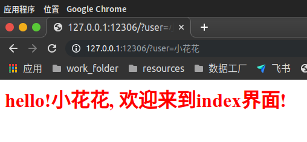
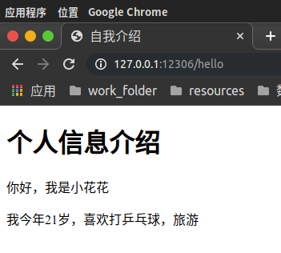

# Flask
## 简单介绍
* `Flask`是一个使用`Python`编写的`轻量级Web应用框架`。其`WSGI工具箱`采用`Werkzeug`，`模板引擎`则使用`Jinja2`。`Flask`使用`BSD授权`。
* Flask也被称为`microframework`，因为它使用简单的核心，用`extension`增加其他功能。`Flask`没有默认使用的`数据库`、`窗体验证工具`。
## 通过pip安装flask
```bash
pip3 install -i https://pypi.tuna.tsinghua.edu.cn/simple flask
```
## 编写第一个flask程序
```python
#!/usr/bin/python3
# @FileName    :first_flask_script.py
# @Time        :2020/5/31 上午12:45
# @Author      :ABC
# @Description :第一个flask程序

# 从flask包导入需要用到的包
from flask import Flask, render_template, request

# 初始化application
app = Flask(__name__)


# 添加路由
@app.route("/")
def index():
    # args = request.args # 获取传入的的参数 可以是：params形式参数、form形式参数、json形式参数、file格式文件
    data = request.args.get("user")

    if data is None:
        return "<h1 style='color:red'>这是index界面</h1>"
    else:
        return "<h1 style='color:red'>hello!" + data + ", 欢迎来到index界面!</h1>"


@app.route("/hello")
def hello():
    # 返回一个HTML格式的文件(默认所有HTML文件都存储在templates目录下，当访问程序运行时匹配到`/hello`时，会自动去templates目录下查找匹配到的HTML文件)
    return render_template('hello.html')


# 运行服务器
# 也可以通过关键字参数绑定host、port、debug(是否开启debug模式：True/False 开启后再更改完代码后，会自动重启flask应用)
app.run(port=12306, debug=True)
```
templates目录下的hello.html文件
```html
<!DOCTYPE html>
<html lang="en">
<head>
    <meta charset="UTF-8">
    <title>自我介绍</title>
</head>
<body>
<h1>个人信息介绍</h1>
<p>你好，我是小花花</p>
<p>我今年21岁，喜欢打乒乓球，旅游</p>
</body>
</html>
```
## 程序执行效果
### 访问根路径`/`不传参数

### 访问根路径`/`带参数

### 访问路径`/hello`返回一个HTML页面


好了，以上今天分享的第一个flask小程序的全部内容了。接下来会持续更新~
